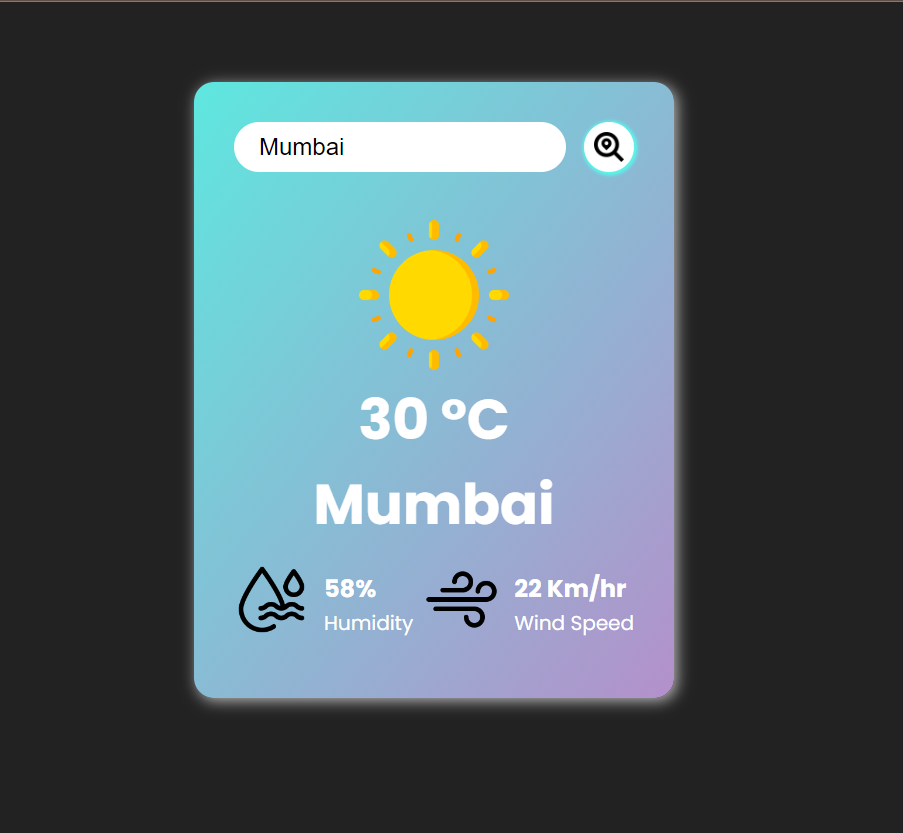

# Weather App



## Description

The Weather App is a web application that provides real-time weather information for locations around the world. It allows users to search for weather forecasts by city name and view details such as temperature, humidity, wind speed, and weather conditions.

The application is built using HTML, CSS, and JavaScript for the frontend, with Node.js and Express.js for the backend. It leverages third-party APIs to fetch weather data and provides a user-friendly interface for accessing weather information.

## Features

- **Search by City**: Users can enter the name of a city and retrieve the current weather forecast for that location.
- **Real-Time Updates**: The weather information is updated in real-time, providing users with the latest weather data.
- **Detailed Weather Information**: The application displays detailed weather information, including temperature, humidity, wind speed, and weather conditions.
- **Rate Limiting**: To prevent abuse and ensure stability, the backend API is rate-limited using `express-rate-limit`.
- **CORS Protection**: Cross-Origin Resource Sharing (CORS) is implemented using `cors` middleware to restrict access to the API from unauthorized domains.
- **Environment Variables**: Configuration settings such as API keys are stored securely using `dotenv` for environment variable management.

## Technologies Used

- Frontend:
  - HTML
  - CSS
  - JavaScript

- Backend:
  - Node.js
  - Express.js

- Libraries and Middleware:
  - `dotenv`: Environment variable management
  - `node-fetch`: API calls
  - `express-rate-limit`: Rate limiting for API endpoints
  - `cors`: Cross-Origin Resource Sharing protection

## Installation and Setup

1. Clone the repository:

   ```bash
   git clone https://github.com/your-username/weather-app.git
   ```

2. Navigate to the project directory:

   ```bash
   cd weather-app
   ```

3. Install dependencies:

   ```bash
   npm install
   ```

4. Set up environment variables:
   - Create a `.env` file in the root directory of the project.
   - Add your API keys and other sensitive information to the `.env` file:

     ```plaintext
     WEATHER_API_KEY=your_weather_api_key_here
     ```

5. Start the server:

   ```bash
   npm start
   ```

6. Open the application in your web browser:

   ```
   http://localhost:3000
   ```

## Deployment

The Weather App can be deployed to various hosting platforms such as Vercel, Netlify, Heroku, or AWS. Follow the deployment instructions provided by your chosen platform to deploy the frontend and backend components of the application.

## License

This project is licensed under the MIT License - see the [LICENSE](LICENSE) file for details.

## Acknowledgements

- Weather data provided by [OpenWeather](https://openweathermap.org/)
- Icons used in the application sourced from [Flaticon](https://www.flaticon.com/)
